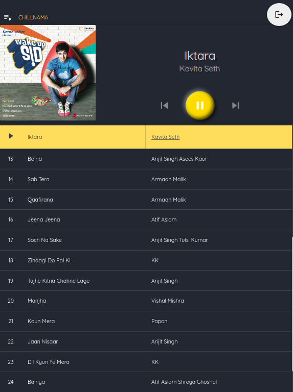

# faMusic

A web based music player, which is a  browser-native single page application (SPA), that uses the browser's native APIs to manage songs' playing environment. It can be very easily integrated to a backend service for authentication and fetching songs (something to do in the future). As of now, it takes a hardcoded login/pass and plays songs from a json in a file (static).

### Key Features

<table>
    <tr>
        <td>An elegant login page with a different picture on the left everytime page reloads</td>
        <td></td>
    </tr>
    <tr>
        <td>A beautiful audio player with very subtle detailing and great UX</td>
        <td></td>
    </tr>
    <tr>
        <td>Supports multiple playlists which can be chosen from the button above</td>
        <td></td>
    </tr>
    <tr>
        <td>Native audio player in desktop browser's media tab and mobile browser's notifiaction bar</td>
        <td></td>
    </tr>
    <tr>
        <td>Great UX includes showing various states the audio player is in, to the user</td>
        <td>
            
            
        </td>
    </tr>
    <tr>
        <td>Cross browser and screen-sizes functional  1.Phone 2. iPad 3. MacBook</td>
        <td>
            
            
            
        </td>
    </tr>
</table>

### Tech Stack

### Acknowledgements

- Original idea for this application was of [Shubhangi](https://goyalshubhangi.github.io/)
- Since no backend is used
    - The login module has hardcoded authentication as of now
    - The songs are served from a static JSON file

### Licensing

All scripts and markups in this repository are under [GNU General Public License - Version 3](LICENSE)
